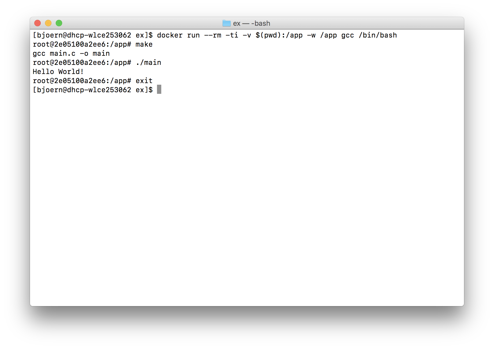

# Docker commands

1. Install [Docker](https://www.docker.com/)
2. Run a command to spawn a new shell with the code at the current location
3. The docker container destroys itself on exit (no cleanup required)


### GCC / G++ / Make
```
docker run --rm -ti -v $(pwd):/app -w /app gcc /bin/bash
```
